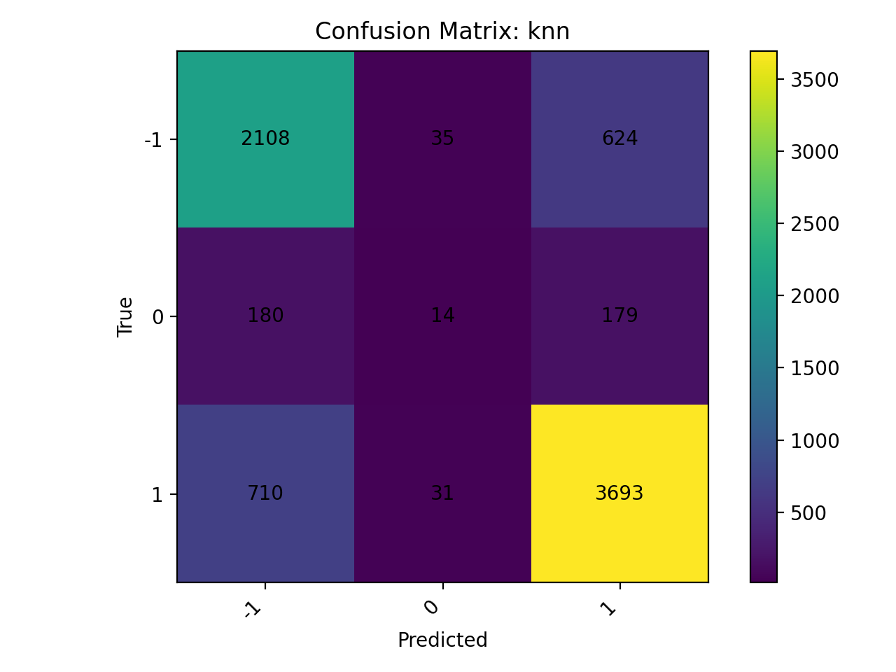
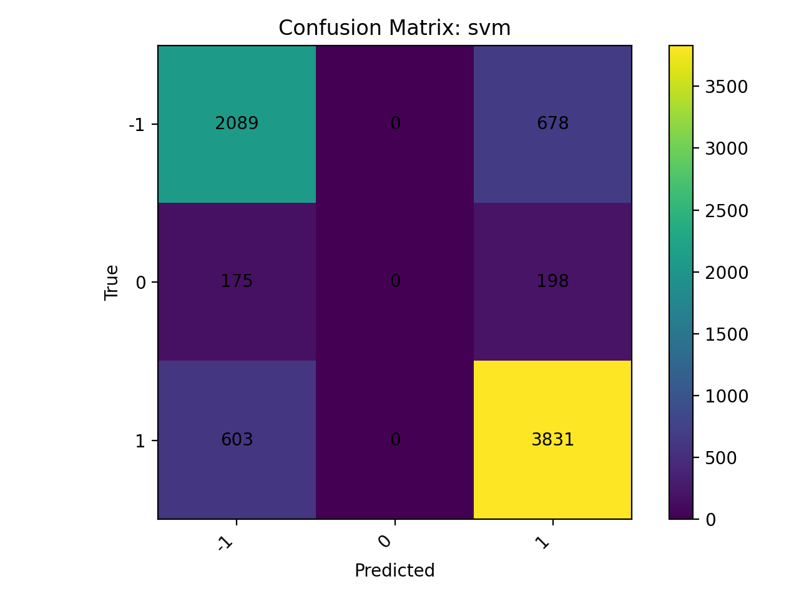
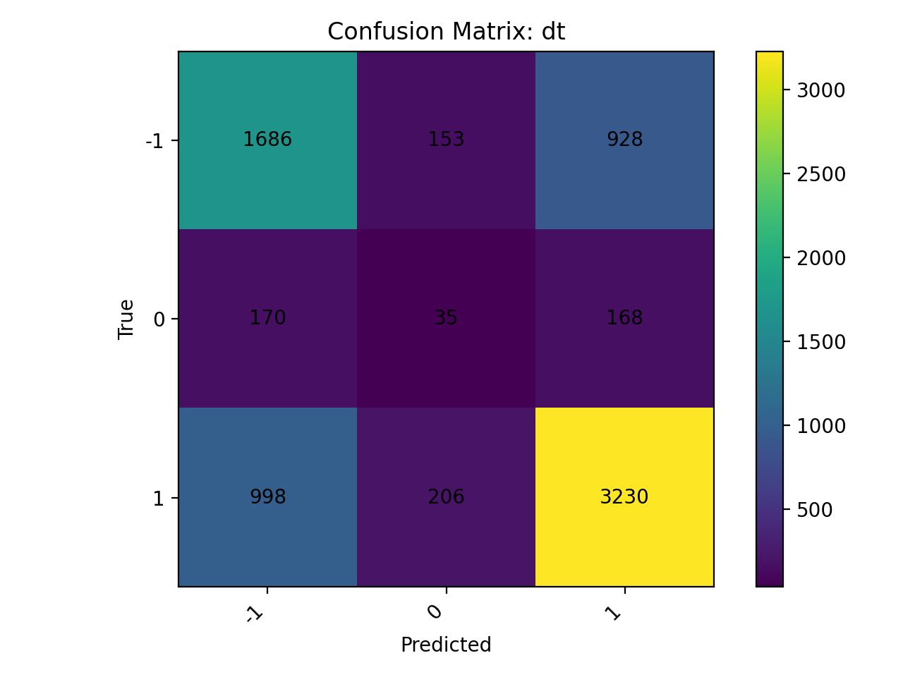

# Training Report (20260117_045625)

## Dataset & Settings
- CSV: `data/final.csv`
- Embeddings source: `file:outputs/embeddings/model2vec_vectors.pkl`
- Label column: `rating`
- Classes (3): `-1`, `0`, `1`
- Split: test_size = **0.2**, seed = **42**
- X shape: `(37870, 128)`

## Model Metrics (per model)

| Model | Accuracy | Precision (macro) | Recall (macro) | F1 (macro) | ROC AUC (binary) |
|---|---:|---:|---:|---:|---:|
| `knn` | 0.7678 | 0.5665 | 0.5441 | 0.5401 | N/A |
| `lr` | 0.7811 | 0.5142 | 0.5385 | 0.5260 | N/A |
| `rf` | 0.7827 | 0.6158 | 0.5408 | 0.5349 | N/A |
| `svm` | 0.7816 | 0.5142 | 0.5397 | 0.5266 | N/A |
| `dt` | 0.6537 | 0.4754 | 0.4772 | 0.4762 | N/A |

## Confusion Matrices (per model)

### `knn`

### `lr`

### `rf`

### `svm`

### `dt`

## Best Model

- Best by **macro F1**: `knn`
- Accuracy: **0.7678**
- Precision (macro): **0.5665**
- Recall (macro): **0.5441**
- F1 (macro): **0.5401**

- Saved model: `outputs/models/best_model_20260117_045625.pkl`
